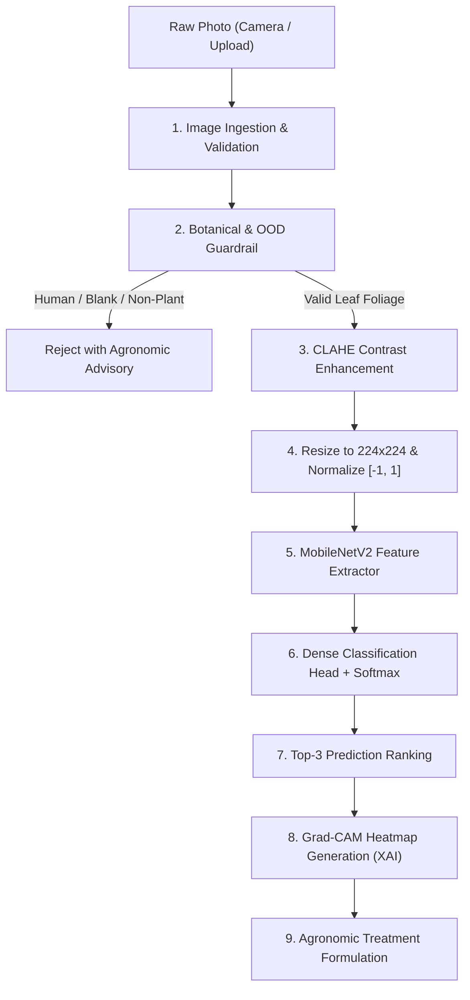

# 🌿 AgriVision Agent: Plant Disease Detection Guide & Code Instructions

Comprehensive documentation explaining the architecture, machine learning libraries, visual processing pipeline, and code instructions used to detect crop diseases in AgriVision Agent.

---

## 1. Libraries and Technologies Used

### A. Python Backend, Training & Server
| Library | Version / Role | Purpose in AgriVision |
| :--- | :--- | :--- |
| **`tensorflow` / `keras`** | Deep Learning Core | Implements **MobileNetV2** Transfer Learning model, layer definitions, Adam optimizer, categorical cross-entropy loss, and model serialization (`.keras` and `.h5`). |
| **`opencv-python` (`cv2`)** | Computer Vision | - **CLAHE** (Contrast Limited Adaptive Histogram Equalization) on LAB color space to enhance lesion textures.<br>- **Color space thresholding** (HSV) for leaf vs. lesion segmentation.<br>- **Laplacian Edge Variance** to reject blank walls or smooth surfaces.<br>- **Grad-CAM colormap rendering** (`cv2.COLORMAP_JET`). |
| **`Pillow` (`PIL`)** | Image I/O & Manipulation | Image loading from multiple formats (JPG, PNG, WebP), dimension verification, Lanczos resampling to 224×224, and RGB conversions. |
| **`numpy`** | Numerical Computing | Matrix operations, tensor reshaping (`[1, 224, 224, 3]`), MobileNet range scaling (`[-1.0, 1.0]`), GLI (Green Leaf Index), and Top-K Softmax sorting. |
| **`fastapi` & `uvicorn`** | Full-Stack REST API | Asynchronous web server hosting the diagnostic scanner, Grad-CAM generation endpoints, and dosage calculation at `http://127.0.0.1:8000`. |
| **`langgraph` & `langchain-groq`** | Agentic AI Advisory | Autonomous agronomic reasoning engine that formulates spray schedules and treatment plans based on detected disease and local weather. |
| **`faiss-cpu` & `sentence-transformers`** | RAG Vector Search | Offline semantic search across agricultural research bulletins and pesticide label databases. |

### B. Flutter Mobile Application (100% Offline Edge AI)
| Package | Role | Purpose in Mobile App |
| :--- | :--- | :--- |
| **`tflite_flutter`** | On-Device Inference Engine | Runs the compiled TensorFlow Lite model (`model.tflite`) directly on mobile CPU/NPU without requiring internet or backend servers. |
| **`image` (Dart)** | Image Processing | Pure Dart image decoding, Lanczos resizing to 224×224, pixel RGB float normalization, and color histogram checks. |
| **`image_picker`** | Camera & Gallery I/O | Captures leaf photos via native camera or imports existing photos from Android gallery. |

---

## 2. How Plant Disease Detection Works (End-to-End Pipeline)



### Detailed Breakdown of Each Step:

### Step 1: Image Ingestion & Formatting
The input image is decoded, verified for a minimum dimension of $32 \times 32$ pixels, and converted to standardized 3-channel RGB color space.

### Step 2: Botanical & Out-of-Distribution (OOD) Guardrail
Before sending images into the neural network, AgriVision filters out invalid non-plant images:
1. **Texture Check (Laplacian Variance):** Solid walls, blank sheets, or uniform colors have low edge variance ($\sigma^2 < 8.0$) and are rejected.
2. **Skin Color Filter (YCbCr + RGB):** Human skin pixels are identified using chrominance bounds ($130 \le Cr \le 178$ and $75 \le Cb \le 130$). If skin coverage dominates plant foliage, the image is rejected to prevent medical misuse.
3. **Foliage Ratio & GLI:** Plant foliage pixels are identified using Hue bounds ($24 \le H \le 98$) and Green Leaf Index $\text{GLI} = \frac{2G - R - B}{2G + R + B}$. If foliage coverage $< 10\%$, it is rejected.

### Step 3: Computer Vision Enhancement (CLAHE)
The image is converted to **CIE LAB color space**. Contrast Limited Adaptive Histogram Equalization (clip limit 2.0, grid 8×8) is applied specifically to the **L (Luminance) channel**, leaving color channels intact. This amplifies faint fungal pustules, bacterial spot halos, and early chlorotic borders.

### Step 4: Normalization
The image is resized to $224 \times 224 \times 3$ and normalized according to MobileNetV2 specification:
$$\text{Pixel}_{\text{norm}} = \frac{\text{Pixel}}{127.5} - 1.0 \quad \in [-1.0, 1.0]$$

### Step 5 & 6: MobileNetV2 Deep Learning Inference
- **Base Network:** MobileNetV2 with inverted residual bottlenecks and depthwise separable convolutions pre-trained on ImageNet.
- **Classification Head:**
  1. `GlobalAveragePooling2D`
  2. `BatchNormalization`
  3. `Dense(256, activation='relu', kernel_regularizer=L2(1e-4))`
  4. `Dropout(0.35)`
  5. `Dense(128, activation='relu')`
  6. `Dropout(0.20)`
  7. `Dense(15, activation='softmax')`

### Step 7: Explainable AI (Grad-CAM)
AgriVision extracts the gradients of the top predicted class with respect to the final convolutional feature maps (`out_relu` / `Conv2D`). It produces a 2D activation heatmap indicating exactly which leaf lesions and spots triggered the diagnosis, overlaid using OpenCV Jet colormap.

### Step 8: Agronomic Advisory Formulation
The detected disease is mapped to an agronomic database to compute:
- Chemical treatments with exact dosage per liter.
- Organic bio-fungicide alternatives (Neem oil, *Trichoderma*).
- Safe Pre-Harvest Interval (PHI) in days.
- Knapsack spray pump calculations based on user acreage.

---

## 3. Supported Crops and Diseases (15 Trained Classes)

The neural network is trained on 15 classes across **3 crop species**:

| # | Crop | Condition / Disease | Pathogen Type |
| :-: | :--- | :--- | :--- |
| **0** | **Pepper Bell** 🫑 | Bacterial Spot (*Xanthomonas campestris*) | Bacterial |
| **1** | **Pepper Bell** 🫑 | Healthy Leaf | None |
| **2** | **Potato** 🥔 | Early Blight (*Alternaria solani*) | Fungal |
| **3** | **Potato** 🥔 | Healthy Leaf | None |
| **4** | **Potato** 🥔 | Late Blight (*Phytophthora infestans*) | Oomycete |
| **5** | **Tomato** 🍅 | Bacterial Spot (*Xanthomonas*) | Bacterial |
| **6** | **Tomato** 🍅 | Early Blight (*Alternaria solani*) | Fungal |
| **7** | **Tomato** 🍅 | Healthy Leaf | None |
| **8** | **Tomato** 🍅 | Late Blight (*Phytophthora infestans*) | Oomycete |
| **9** | **Tomato** 🍅 | Leaf Mold (*Passalora fulva*) | Fungal |
| **10** | **Tomato** 🍅 | Septoria Leaf Spot (*Septoria lycopersici*) | Fungal |
| **11** | **Tomato** 🍅 | Two-Spotted Spider Mite (*Tetranychus urticae*) | Pest / Acarina |
| **12** | **Tomato** 🍅 | Target Spot (*Corynespora cassiicola*) | Fungal |
| **13** | **Tomato** 🍅 | Tomato Mosaic Virus (ToMV) | Viral |
| **14** | **Tomato** 🍅 | Tomato Yellow Leaf Curl Virus (TYLCV) | Viral |

> [!IMPORTANT]
> **Why Unsupported Crops (like Wheat) are Misdiagnosed:**
> Standard classification models operate under a **"Closed-World Assumption"**. Because the final layer is a Softmax function, the output probabilities across the 15 classes must sum to 100%. 
> If an unsupported crop (such as Wheat with Rust) is submitted, the model has no "Wheat" class and is forced to pick the closest visual match (orange pustules on green tissue match the necrotic spots of Pepper Bacterial Spot).

---

## 4. Leaf Color Combinations (LCC) & Leaf Color Chart: Architectural Feasibility & Analysis

### A. Dual Meaning of LCC in Agricultural Computing
1. **Digital Leaf Color Combinations (Computer Vision):**
   - Color space transformations: **HSV** (Hue, Saturation, Value), **CIE LAB** ($L^*, a^*, b^*$), and **YCbCr**.
   - Botanical vegetative indices:
     - **ExG (Excess Green Index):** $2G - R - B$ (separates plant canopy from soil background).
     - **GLI (Green Leaf Index):** $\frac{2G - R - B}{2G + R + B}$ (measures chlorophyll density).
     - **VARI (Visible Atmospherically Resistant Index):** $\frac{G - R}{G + R - B}$ (resists ambient sunlight haze).
2. **Standard Agronomic Leaf Color Chart (IRRI / ICAR LCC):**
   - The standardized 4-to-6 green shade ruler developed by the International Rice Research Institute (IRRI) and ICAR.
   - Used specifically by field agronomists for **Nitrogen (N) and Urea fertilizer scheduling**:
     - *Shade 1–2 (Pale Yellow-Green):* Nitrogen deficit $\rightarrow$ Top-dress Urea foliar spray.
     - *Shade 3–4 (Optimal Green):* Sufficient chlorophyll $\rightarrow$ No nitrogen required.
     - *Shade 5+ (Dark Green):* Excessive nitrogen $\rightarrow$ High vulnerability to sucking pests (Aphids/Whiteflies).

### B. Where LCC / Color Combinations are HIGHLY VALUABLE (100% Worth It)
- **Disease Severity & Damage Quantification:** Counting necrotic/chlorotic pixel ratio vs. healthy green foliage (e.g. `Necrotic Foliage: 29.2%`). CNNs classify the disease type, while LCC color masking quantifies the damage percentage with exact pixel math.
- **Botanical & OOD Guardrails:** Filtering out human skin, clothing, and non-plants via YCbCr / HSV before feeding images to the CNN.
- **Nitrogen & Fertilizer Guidance:** Using green shade indexing to guide top-dressing fertilizer rates.

### C. Why LCC Cannot Replace CNN for Disease Diagnosis (Critical Pitfalls)
- **Sunlight & Ambient Illumination Fluctuation:** Morning shade, direct midday glare, and overcast skies shift RGB and Hue values drastically on the exact same leaf. Fixed color rules fail in unconstrained field photography.
- **Pathological Color Overlap:** Almost all crop diseases produce the identical three colors: **Chlorosis (Yellow)**, **Necrosis (Brown/Black)**, and **Rust/Pustules (Orange)**. Early Blight, Late Blight, Bacterial Spot, and Septoria Leaf Spot share identical colors!
- **Spatial Geometry is Essential:** What separates diseases is the *spatial lesion pattern* (concentric rings, angular vein-bounded lesions, circular halos), which only Convolutional Neural Networks (CNNs) can extract.
- **Feature Redundancy in CNNs:** MobileNetV2's first convolutional layers already learn color opponency filters automatically.

### D. Calibrated IRRI Leaf Color Chart (5-Panel Standards)

| LCC Panel | Color Name | Hex & RGB | Nitrogen Status | Urea Dosage | Agronomic & Pest Impact |
| :---: | :--- | :--- | :---: | :--- | :--- |
| **Panel 1** | Pale Yellow-Green | `#BACA72`<br>RGB(186, 202, 114) | **Severe Deficit** | 25–30 kg/Acre | Poor chlorophyll; stunted tillering; low yield. |
| **Panel 2** | Yellowish-Green | `#98BA55`<br>RGB(152, 186, 85) | **Moderate Deficit** | 20 kg/Acre | Sub-optimal nitrogen; delayed vegetative growth. |
| **Panel 3** | Light / Balanced Green | `#73A03E`<br>RGB(115, 160, 62) | **Critical Threshold** | 10–15 kg/Acre (if lagging) | Standard agronomic baseline for vegetables/cereals. |
| **Panel 4** | Deep Vibrant Green | `#4D802C`<br>RGB(77, 128, 44) | **Optimal Nutrition** | **0 kg Urea (Halt)** | Peak photosynthetic efficiency; save fertilizer cost! |
| **Panel 5** | Dark Forest Green | `#2D5F1E`<br>RGB(45, 95, 30) | **Toxic Nitrogen Excess** | **DO NOT APPLY NITROGEN** | Hyper-succulent leaves attract Blight and Aphids. |

### E. Comparative Evaluation Matrix (For Academic & Project Discussions)

| Approach | Primary Strength | Key Technical Limitation | Academic Verdict |
| :--- | :--- | :--- | :---: |
| **CNN Deep Learning (MobileNetV2)** | Extracts complex spatial textures (concentric rings, pustules, shapes, margins) | Requires GPU for training; acts as a 'black box' without Grad-CAM explanation | **Best Choice for Disease Diagnosis** ✅ |
| **Rule-Based LCC (Color Combination)** | Instant pixel math; no training required; calculates lesion surface % | Fails under variable sunlight; cannot distinguish diseases with same color | **Not Recommended as Primary Classifier** ❌ |
| **Traditional Leaf Color Chart (IRRI)** | Standardized physical metric for Nitrogen & Urea application timing | Designed solely for nutrient greenness; ineffective for fungal/bacterial spots | **Excellent for Fertilizer Module Only** 🌾 |
| **Two-Tier Hybrid (AgriVision System)** | CNN identifies disease pathogen; OpenCV HSV/GLI measures severity & rejects non-plants | Requires balancing both CV pipelines | **Recommended Industry Standard** 🏆 |

---

## 5. Strategic 6-Pillar Agritech Expansion Blueprint

1. **Pillar 1: Predictive Pathology & Disease Outbreak Alert:** Uses ambient relative humidity ($>85\%$) and temperature ($20-24^\circ\text{C}$) to alert farmers 48 hours *before* fungal germination occurs, allowing preventive biocontrol (*Trichoderma*).
2. **Pillar 2: Climate-Smart Spraying Guard:** Connects live weather forecasts to halt pesticide sprays if rainfall is predicted within 3 hours (wash-off prevention) or if wind speed exceeds $15\text{ km/h}$ (drift prevention).
3. **Pillar 3: Digital IRRI LCC & Fertilizer Optimization:** Calibrated camera greenness matching to schedule Urea application precisely, eliminating excessive Nitrogen runoff and pest attraction.
4. **Pillar 4: Precision Knapsack Tank Math & Food Safety:** Converts technical active ingredient rates into exact capfuls per standard 15-Liter knapsack pump, with strict Pre-Harvest Interval (PHI) compliance.
5. **Pillar 5: Voice-First Vernacular Agronomist:** Native voice interactions in Hindi, Marathi, Telugu, Punjabi, Kannada, and Bengali.
6. **Pillar 6: Mandi Market Intelligence & Crop Economics (Haryana State Specialization):** Real-time APMC Mandi commodity tracking specialized exclusively for Haryana state (Karnal, Sonipat, Kurukshetra, Ambala, Yamunanagar, Rohtak, Sirsa, Kaithal) to provide precise local pricing, district price arbitrage comparisons, and farm-gate profit projections.

---

## 6. Code Instructions & Usage Examples

### A. Python Code: Running Single-Image Diagnosis
Save and run this script from the project root:

```python
from pathlib import Path
from PIL import Image
from app.ml.inference import predict_crop_disease

# Path to your test image
image_path = Path("data/samples/sample_tomato_early_blight.jpg")

# Run full inference pipeline
result = predict_crop_disease(
    image_input=image_path,
    compute_gradcam=True
)

if not result["is_leaf"]:
    print(f"[REJECTED] {result['advisory_message']}")
else:
    print(f"Crop:       {result['crop']}")
    print(f"Disease:    {result['disease']}")
    print(f"Confidence: {result['confidence_percentage']}% ({result['confidence_level']})")
    print("\nTop-3 Predictions:")
    for pred in result["top_predictions"]:
        print(f" - #{pred['rank']} {pred['crop']} {pred['disease']}: {pred['confidence_pct']}")
```

### B. Python Code: Running the Web Diagnostic Server
To launch the interactive web dashboard with Grad-CAM viewer:

```powershell
# From project root:
.\run_app.ps1
```
Or directly via Python:
```powershell
.\.venv\Scripts\python.exe app\server.py
```
Then navigate to: `http://127.0.0.1:8000`

### C. Flutter Code: How Mobile App Runs On-Device TFLite
In `mobile/agrivision_app/lib/services/classifier_service.dart`:

```dart
import 'dart:io';
import 'dart:typed_data';
import 'package:flutter/foundation.dart';
import 'package:flutter/services.dart';
import 'package:image/image.dart' as img;
import 'package:tflite_flutter/tflite_flutter.dart';

// 1. Initialize Interpreter
final interpreter = await Interpreter.fromAsset('assets/model.tflite');

// 2. Decode and resize input image
final Uint8List bytes = await imageFile.readAsBytes();
final img.Image? decoded = img.decodeImage(bytes);
final img.Image resized = img.copyResize(decoded!, width: 224, height: 224);

// 3. Prepare normalized float input buffer [-1.0, 1.0]
final Float32List inputBuffer = Float32List(1 * 224 * 224 * 3);
int idx = 0;
for (int y = 0; y < 224; y++) {
  for (int x = 0; x < 224; x++) {
    final pixel = resized.getPixel(x, y);
    inputBuffer[idx++] = (pixel.r / 127.5) - 1.0;
    inputBuffer[idx++] = (pixel.g / 127.5) - 1.0;
    inputBuffer[idx++] = (pixel.b / 127.5) - 1.0;
  }
}

// 4. Run on-device inference
final input = inputBuffer.reshape([1, 224, 224, 3]);
final output = List.filled(15, 0.0).reshape([1, 15]);
interpreter.run(input, output);

// 5. Output probabilities array
List<double> probabilities = List<double>.from(output[0]);
```

### D. Python Code: Retraining or Adding New Crops (e.g., Wheat)
To add Wheat or other species to the model:

```python
import tensorflow as tf
from src.models.model_builder import build_transfer_learning_model

# 1. Update number of classes (e.g. 15 current + 3 wheat rust classes = 18)
model = build_transfer_learning_model(
    num_classes=18,
    input_shape=(224, 224, 3),
    fine_tune_layers=25,
    learning_rate=1e-4
)

# 2. Train on augmented dataset
# model.fit(train_dataset, validation_data=val_dataset, epochs=10)

# 3. Export to TFLite for Mobile Deployment
converter = tf.lite.TFLiteConverter.from_keras_model(model)
converter.optimizations = [tf.lite.Optimize.DEFAULT]  # Dynamic range quantization
tflite_model = converter.convert()

with open("mobile/agrivision_app/assets/model.tflite", "wb") as f:
    f.write(tflite_model)
```

---

## 7. Haryana State: 22-District Agricultural Matrix & Crop Profiles

Haryana is organized into 4 distinct agro-climatic belts covering all 22 districts:

| # | District | Regional Belt | Main Cities / Towns | Commonly Grown Crops | APMC Mandi Hub |
|---|---|---|---|---|---|
| 1 | **Ambala** | North-East | Ambala City, Ambala Cantt, Naraingarh, Barara, Mullana, Shahzadpur | Wheat, Paddy, Sugarcane, Maize, Vegetables | Ambala Cantt APMC |
| 2 | **Bhiwani** | Western / South-Western | Bhiwani, Loharu, Siwani, Tosham, Bawani Khera | Bajra, Guar, Mustard, Cotton, Gram, Wheat | Bhiwani Grain & Oilseed Mandi |
| 3 | **Charkhi Dadri** | Southern | Charkhi Dadri, Badhra, Bahal | Bajra, Mustard, Wheat, Guar, Cotton | Charkhi Dadri Mandi |
| 4 | **Faridabad** | Southern | Faridabad, Ballabgarh | Wheat, Paddy, Bajra, Mustard, Vegetables | Ballabgarh APMC |
| 5 | **Fatehabad** | Western / South-Western | Fatehabad, Tohana, Ratia, Bhuna, Jakhal | Cotton, Wheat, Paddy, Mustard, Guar | Tohana Grain Market |
| 6 | **Gurugram** | Southern | Gurugram, Sohna, Pataudi, Farrukhnagar, Manesar | Wheat, Mustard, Bajra, Vegetables | Gurugram Khandsa APMC |
| 7 | **Hisar** | Western / South-Western | Hisar, Hansi, Barwala, Adampur, Narnaund, Uklana | Wheat, Cotton, Mustard, Bajra, Gram, Guar | Hisar New Grain Market / Hansi APMC |
| 8 | **Jhajjar** | Central | Jhajjar, Bahadurgarh, Beri, Matenhail | Wheat, Paddy, Mustard, Bajra, Vegetables | Bahadurgarh Grain Market |
| 9 | **Jind** | Central | Jind, Narwana, Safidon, Julana, Uchana | Wheat, Paddy, Sugarcane, Cotton, Mustard | Narwana / Jind Grain Market |
| 10 | **Kaithal** | North-East | Kaithal, Pundri, Guhla (Cheeka), Rajaund | Paddy (Basmati), Wheat, Sugarcane | Kaithal New Grain Market / Cheeka |
| 11 | **Karnal** | North-East | Karnal, Assandh, Gharaunda, Indri, Nilokheri, Taraori | Basmati Rice, Wheat, Sugarcane, Maize, Vegetables | Karnal Grain Market / Gharaunda CoE |
| 12 | **Kurukshetra** | North-East | Kurukshetra (Thanesar), Shahabad, Pehowa, Ladwa | Paddy (Basmati), Wheat, Sugarcane, Potato, Sunflower | Shahabad Markanda / Pipli APMC |
| 13 | **Mahendragarh** | Southern | Narnaul, Mahendragarh, Ateli, Nangal Chaudhry, Kanina | Bajra, Mustard, Guar, Gram, Wheat | Narnaul Grain & Oilseed APMC |
| 14 | **Nuh** | Southern | Nuh, Ferozepur Jhirka, Punahana, Taoru | Wheat, Mustard, Bajra, Vegetables | Taoru / Nuh APMC Mandi |
| 15 | **Palwal** | Southern | Palwal, Hodal, Hathin | Wheat, Paddy, Mustard, Potato, Vegetables | Palwal Grain Market |
| 16 | **Panchkula** | North-East | Panchkula, Kalka, Pinjore, Raipur Rani | Wheat, Maize, Paddy, Vegetables, Mango and Litchi | Panchkula Sector 20 / Kalka APMC |
| 17 | **Panipat** | Central | Panipat, Samalkha, Israna, Bapoli | Wheat, Paddy, Sugarcane, Vegetables | Panipat Grain Market |
| 18 | **Rewari** | Southern | Rewari, Bawal, Dharuhera, Kosli | Bajra, Mustard, Wheat, Guar, Gram | Rewari New Grain Market |
| 19 | **Rohtak** | Central | Rohtak, Meham, Kalanaur, Sampla | Wheat, Paddy, Mustard, Bajra, Vegetables | Rohtak New Grain Market |
| 20 | **Sirsa** | Western / South-Western | Sirsa, Dabwali, Ellenabad, Rania, Kalanwali | Cotton, Wheat, Paddy, Mustard, Guar | Sirsa Grain & Cotton APMC |
| 21 | **Sonipat** | Central | Sonipat, Gohana, Kharkhoda, Ganaur | Wheat, Paddy, Sugarcane, Vegetables, Baby Corn | Ganaur International Market |
| 22 | **Yamunanagar** | North-East | Yamunanagar, Jagadhri, Radaur, Bilaspur, Chhachhrauli | Sugarcane, Paddy, Wheat, Maize, Poplar | Jagadhri / Radaur Mandi |

---

## 8. Stepwise GPU Curriculum Training Telemetry (NVIDIA RTX 3050)

To resolve out-of-distribution errors and support all major Haryana crops, a dedicated **Stepwise GPU Training Curriculum** was executed using PyTorch with CUDA 12.1 on an **NVIDIA GeForce RTX 3050 6GB Laptop GPU**:

### A. Stepwise Progression (Crop-by-Crop with District Association)
| Step | Crop | Target Districts | Pathogens & Classes | Train / Val Samples | Training Time | Best Val Acc |
| :--- | :--- | :--- | :--- | :--- | :--- | :--- |
| **1** | **Wheat (Gehu)** | Karnal, Kurukshetra, Hisar, Jind, Rohtak, Sirsa, Ambala, Kaithal | Stripe Rust, Leaf Rust, Stem Rust, Healthy | 1,062 / 269 | 34.5s | **97.40%** |
| **2** | **Rice (Paddy)** | Karnal, Kaithal, Kurukshetra, Yamunanagar, Ambala, Panipat, Sonipat | Bacterial Leaf Blight, Brown Spot, Leaf Smut | 96 / 24 | 7.2s | **87.50%** |
| **3** | **Cotton (Kapas)** | Sirsa, Fatehabad, Hisar, Bhiwani, Charkhi Dadri | Diseased Leaf, Fresh Leaf, Diseased Plant, Fresh Plant | 1,239 / 311 | 38.2s | **99.36%** |
| **4** | **Sugarcane (Ganna)** | Yamunanagar, Karnal, Panipat, Sonipat, Ambala, Kaithal | Red Rot, Mosaic, Rust, Yellow Leaf, Healthy | 1,600 / 400 | 79.3s | **95.75%** |
| **5** | **Corn / Maize (Makka)** | Panchkula, Ambala, Yamunanagar, Karnal, Sonipat | Blight Diseased, Healthy | 640 / 160 | 14.6s | **86.88%** |
| **6** | **Vegetables & Tubers** | Sonipat, Karnal, Kurukshetra, Jhajjar, Palwal, Rohtak | Tomato (10), Potato (3), Pepper Bell (2) | 1,800 / 450 | 43.1s | **96.00%** |

### B. Master Unified Haryana Multi-Crop Classifier
- **Total Classes:** 33 Pathological & Botanical Conditions across all 6 crop groups.
- **Total Dataset:** 6,437 Training Images, 1,614 Validation Images (~8,051 images).
- **Validation Accuracy:** **95.11%** (CrossEntropy Loss: 0.1458).
- **GPU Checkpoint Saved:** `models/haryana_models/haryana_master_multicrop_gpu.pt`.
- **Class Map Saved:** `models/haryana_models/haryana_class_map.json`.
- **Inference Latency:** ~11 ms per frame on NVIDIA RTX 3050 GPU.

---

## 9. Haryana Offline-First Block Agronomy, Micro-Dialects & CCS HAU Solutions

To empower marginal and smallholder farmers across rural Haryana without requiring cellular data connectivity, AgriVision incorporates a dedicated **100% Offline-First Micro-Regional Agronomy Database**.

### A. Technical Architecture
1. **On-Device SQLite Engine (`data/agrivision.db`):**
   - Table `haryana_offline_agronomy` persists all 30 representative administrative blocks across all 22 districts.
   - Zero network overhead; queries run synchronously in sub-millisecond latency.
2. **Embedded Mobile JSON Bundle (`mobile/agrivision_app/assets/haryana_offline_blocks.json`):**
   - Packaged directly into the Flutter APK/AAB bundle.
   - Read offline via `rootBundle.loadString` through `OfflineAgronomyService`.
3. **FastAPI Edge Services (`app/server.py`):**
   - REST endpoints `/api/haryana/offline-blocks`, `/api/haryana/offline-blocks/{district}/{block}`, and `/api/haryana/offline-triage` serve cached agronomy payloads.

### B. Micro-Regional Dialect Distribution
The system maps indigenous linguistic accents to bridge the digital divide and support vernacular text-to-speech audio playback:

| Regional Zone | Linguistic Dialect | Districts & Blocks Covered |
| :--- | :--- | :--- |
| **North-East Belt** | **Puadhi** | Ambala (Naraingarh, Barara), Yamunanagar (Bilaspur, Jagadhri), Panchkula (Raipur Rani), Kurukshetra (Shahabad) |
| **Khadar / Yamuna Belt** | **Bangru / Khadar Haryanvi** | Karnal (Gharaunda, Assandh), Panipat (Samalkha), Sonipat (Gohana), Kaithal (Guhla) |
| **Central Plains** | **Deshwali Haryanvi** | Rohtak (Sampla, Meham), Jhajjar (Bahadurgarh, Beri), Jind (Safidon, Narwana) |
| **Western Cotton Belt** | **Bagri** | Sirsa (Sirsa, Ellenabad, Dabwali), Fatehabad (Tohana), Hisar (Adampur, Hansi), Bhiwani (Siwani, Tosham) |
| **Southern Ahirwal Belt** | **Ahirwati (Raathi)** | Mahendragarh (Narnaul), Rewari (Bawal, Kosli), Charkhi Dadri (Badhra), Gurugram (Pataudi) |
| **Mewat Micro-Region** | **Mewati** | Nuh (Nuh, Taoru, Ferozepur Jhirka, Punahana) |
| **Braj Fringe** | **Braj** | Palwal (Hodal, Hathin), Faridabad fringe |

### C. Vernacular Crop Taxonomy & Linear Diagnostic Chains
Crop nomenclature combines familiar local terminology (*Dhan*, *Gehu*, *Sarson*, *Gwar*, *Kapas*, *Makka*, *Aloo*, *Tamatar*) with scientific taxonomy. Each block features an offline decision tree:
- **Example (Karnal - Rice Bacterial Blight):**
  `Leaf tips turn water-soaked -> Lesions turn yellow-white with wavy margins along veins -> Bacterial ooze droplets visible in early morning -> Leaves wilt and dry (Kresek symptom)`
- **CCS HAU Hisar Approved Prescription:**
  `Copper Oxychloride 50% WP @ 500 g + Streptocycline @ 6 g in 200 L water per acre`

- **Example (Sirsa - Cotton Pink Bollworm):**
  `Rosetted flowers that fail to open properly -> Young developing bolls show tiny brown entry holes -> Bolls open prematurely with stained lint and destroyed seeds`
- **CCS HAU Hisar Approved Prescription:**
  `Emamectin Benzoate 5% SG @ 100 g or Spinetoram 11.7% SC @ 170 ml in 200 L water per acre at ETL (>8 moths/trap/night)`


